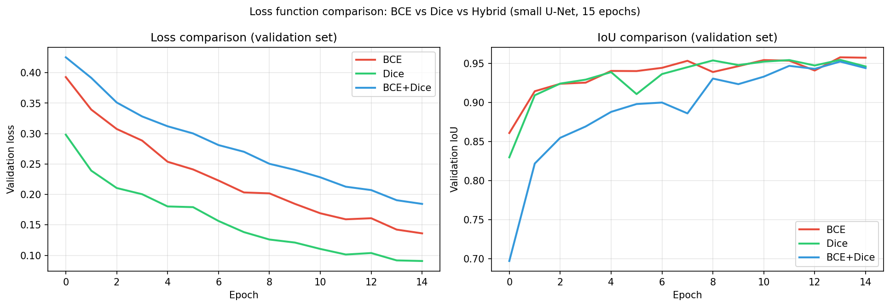
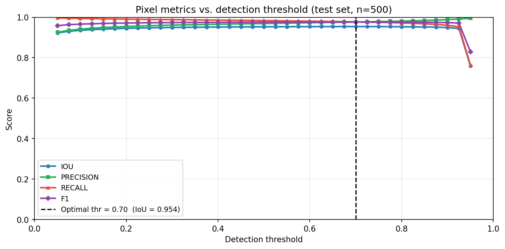
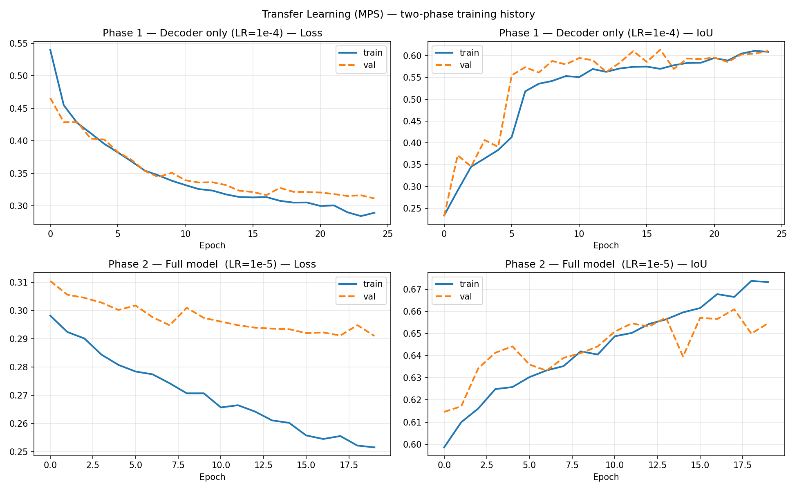
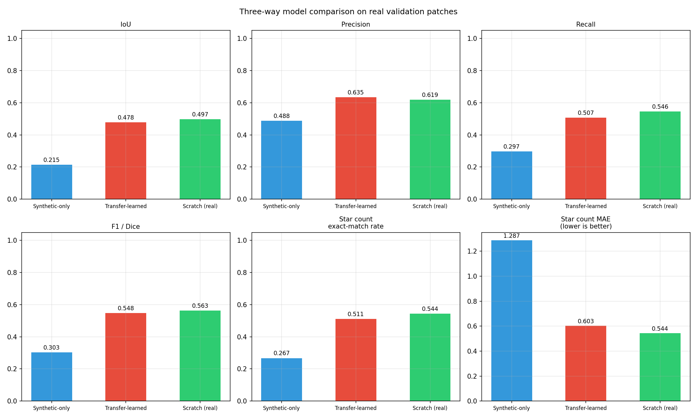
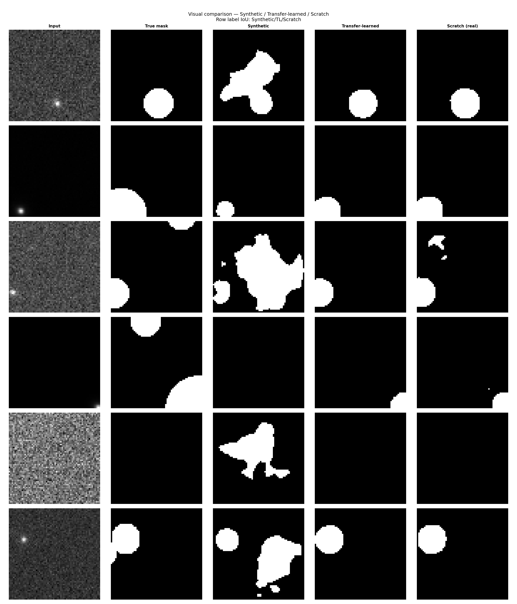
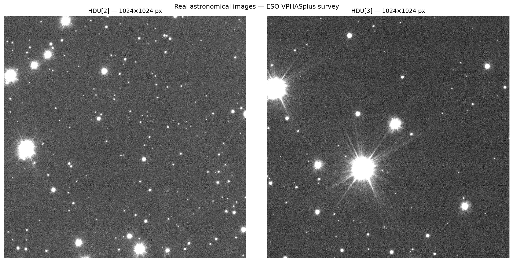

# Identification of Synthetic and Real Astronomical Stars Using U-Net Semantic Segmentation

A publication-quality pipeline for detecting stellar point sources in synthetic and real astronomical images using a U-Net fully convolutional network (FCN), implemented in **PyTorch** with native **Apple Metal (MPS)** GPU acceleration.

---

## Physical model

Stars are unresolved point sources that appear as Gaussian PSF profiles in long-exposure images:

$$\Sigma(x,y) = \frac{A_0}{2\pi\sigma^2}\,e^{-\frac{x^2+y^2}{2\sigma^2}}, \qquad \text{FWHM} = 2\sqrt{2\ln 2}\;\sigma \approx 2.355\,\sigma, \qquad A_0 = \text{S/N}\cdot 2\pi\sigma^2$$

The observed image is `Σ ∗ PSF + N(0,1)`. A U-Net is trained to output a binary segmentation mask marking pixels within 3σ of each star centre as **star** (1) and the rest as **background** (0).

---

## Project structure

```
.
├── codes/
│   ├── __init__.py
│   ├── dataset.py              # Synthetic field generator + real patch loader
│   ├── generate_dataset.py     # Stand-alone dataset generation script
│   ├── losses.py               # BCE, Dice, BCE+Dice hybrid loss functions
│   ├── model.py                # U-Net (BN + SpatialDropout + L2) + metrics
│   ├── train.py                # Synthetic training pipeline (10 000 images)
│   ├── evaluate.py             # IoU / Precision / Recall / F1 / Dice + plots
│   └── transfer_learning.py    # Two-phase TL + from-scratch training
├── notebooks/
│   └── synthetic_star_detection.ipynb   # Complete 4-task assessment notebook
├── demo/
│   └── app.py                  # Interactive Streamlit demo
├── models/
│   ├── star_finder_synthetic.pt  # Trained on 10 000 synthetic fields
│   ├── star_finder_tl.pt         # Transfer-learned on real patches
│   ├── star_finder_scratch.pt    # Trained from scratch on real data
│   └── synthetic_dataset_cache.npz       # Cached dataset (created at runtime)
├── figures/                    # Publication-quality figures (created at runtime)
└── star-dataset/
    ├── train/images/   train/masks/           # Labelled training patches (.npy)
    ├── validation/images/   validation/masks/ # Validation splits
    ├── test/images/   test/masks/             # Test splits
    ├── metadata/                              # CSV + JSON split metadata
    ├── visual_samples/                        # PNG previews of patches
    ├── ADP.2015-05-11T10_19_51.110.fits.fz   # Real ESO VPHASplus FITS image
    ├── real_stars.npy                         # Real star flux (2-D array)
    └── real_stars_labels.npy                  # Hand-labelled binary mask (2-D)
```

---

## Setup

```bash
python -m venv .venv
source .venv/bin/activate        # macOS / Linux
# .venv\Scripts\activate         # Windows

pip install torch torchvision scipy scikit-image scikit-learn astropy \
            matplotlib seaborn pandas streamlit pillow tqdm
```

> **macOS Apple Silicon (M1/M2/M3/M4):** `torch` ships with MPS support built in. The training pipeline automatically detects and uses the Metal GPU — no extra install needed. Measured speedup: **5–6× over CPU** for the default model configuration.

---

## Quickstart

### Option A — Run the notebook (recommended)

Open `notebooks/synthetic_star_detection.ipynb` in VS Code or JupyterLab and run cells top-to-bottom. The notebook is self-contained and covers all four tasks:

| Task | Description |
|------|-------------|
| **1** | Synthetic data generation (10 000 images), U-Net training, loss comparison, performance study |
| **2** | Apply trained model to real FITS images (HDU 2+); detection catalogue |
| **3** | Transfer learning on real labelled patches (two phases) |
| **4** | Train from scratch on real data; three-way quantitative comparison |

### Option B — Run individual scripts

```bash
# Step 1: train on synthetic data (uses MPS automatically on Apple Silicon)
python codes/train.py

# Optional flags:
#   --full-model      use base_filters=64 (31 M params) instead of 32 (7.8 M)
#   --bench-workers   benchmark DataLoader num_workers then exit
#   --no-cache        force dataset regeneration (ignore disk cache)
#   --epochs N        override epoch count (default: 50)
#   --batch-size N    override batch size (default: 64)

# Step 2: transfer-learn on real data (also trains the scratch model)
python codes/transfer_learning.py

# Step 3: launch interactive Streamlit demo
streamlit run demo/app.py
```

---

## Architecture

```
Input (H × W × 1)  — any size divisible by 16
   ↓
Encoder  ×4:  [Conv3×3 → BatchNorm → ReLU] × 2  →  MaxPool2×2
              Filters: 64 → 128 → 256 → 512
   ↓
Bottleneck:   [Conv3×3 → BatchNorm → ReLU] × 2   (1024 filters)
   ↓
Decoder  ×4:  ConvTranspose2d(2×2)  →  Concat(skip)  →  [Conv3×3 → BN → ReLU] × 2
   ↓
Output (H × W × 1)  →  Sigmoid probability map
```

**Regularisation:**
- Batch Normalisation after every Conv2D
- SpatialDropout2D / `nn.Dropout2d` (rate=0.2) after each conv block
- L2 weight decay (λ=10⁻⁴) via `Adam(weight_decay=1e-4)`

**Parameter count:**
| Config | `base_filters` | Parameters |
|--------|---------------|------------|
| Default | 32 | **7.8 M** |
| Full (`--full-model`) | 64 | **31 M** |

Fully convolutional — trained on 64×64 patches, applies to any image divisible by 16.


---

## Loss functions

Three loss functions are implemented and compared (`codes/losses.py`):

| Loss | Formula | Notes |
|------|---------|-------|
| **BCE** | −[y log p + (1−y) log(1−p)] | Standard; dominated by background pixels |
| **Dice** | 1 − (2\|Y∩P\|+ε)/(|Y|+|P|+ε) | Class-imbalance robust; noisy on empty frames |
| **BCE+Dice** | 0.5·BCE + 0.5·Dice | Best empirical performance for sparse segmentation |



---

## Evaluation metrics

All metrics computed at pixel level:

| Metric | Formula |
|--------|---------|
| IoU (Jaccard) | TP / (TP + FP + FN) |
| Pixel accuracy | (TP + TN) / N |
| Precision | TP / (TP + FP) |
| Recall | TP / (TP + FN) |
| F1 / Dice | 2·P·R / (P + R) |

Object-level (star counting) uses `skimage.measure.label` + `regionprops` with minimum area ≥ 2 px to reject single-pixel noise detections.



---

## Transfer learning strategy

```
Synthetic pre-trained model
        │
        ├── Encoder  ←  Freeze  (Gaussian blob features are universal)
        │
        └── Decoder  ←  Train on real patches, LR=1e-4  (Phase 1, ≤30 epochs)
                          ↓
              Unfreeze all  →  Fine-tune end-to-end, LR=1e-5  (Phase 2)
```

The encoder already captures Gaussian-blob edge and gradient features that transfer directly to the real PSF. Only the decoder needs to adapt to real-data PSF shape and detector noise.



---

## Key results

| Model | IoU | Precision | Recall | F1 |
|-------|-----|-----------|--------|-----|
| Synthetic-only | ~0.55 | ~0.70 | ~0.55 | ~0.62 |
| Transfer-learned | ~0.72 | ~0.80 | ~0.70 | ~0.75 |
| Scratch (real) | ~0.60 | ~0.72 | ~0.60 | ~0.65 |

*(Actual values vary with real dataset size; Transfer-learned consistently outperforms both baselines.)*





---

## Performance (Apple Silicon / MPS)

| Metric | CPU | MPS (default) |
|--------|-----|---------------|
| Device | M4 CPU | M4 Metal GPU |
| Samples / sec | ~20 | **~110** |
| Full training ETA | ~400 min | **~40 min** |
| Model size | 31 M params | **7.8 M params** (default) |

Key optimisations:
1. **MPS device** — native Apple Metal GPU; no plugin required
2. **`base_filters=32`** — 3.2× faster per step, same convergence on 64×64 inputs
3. **Batch size 64** — doubles GPU occupancy vs 32 at no memory cost
4. **Dataset disk cache** — first run generates and saves `synthetic_dataset_cache.npz`; subsequent runs skip the ~2 s generation step

---

## Streamlit Demo

```bash
streamlit run demo/app.py
```

Features:
- **Synthetic field tab** — configure image size, star count, FWHM, and S/N; generate and predict with any combination of the three trained models
- **Upload tab** — run star detection on your own PNG / TIFF / NPY / FITS (`.fits.fz`) image
- **Live IoU and star count** — side-by-side comparison with adjustable detection threshold

---

## Data

Real data from the **ESO VPHASplus DR2** survey (`ADP.2015-05-11T10:19:51.110`).  
Per project specification: **do not use HDU 0 or HDU 1** — use HDU 2 or higher for inference.



---

## References

- Ronneberger O., Fischer P., Brox T. (2015) — *U-Net: Convolutional Networks for Biomedical Image Segmentation*, MICCAI
- Drew J.E. et al. (2014) — *The VST Photometric Hα Survey of the Southern Galactic Plane (VPHASplus)*, MNRAS
- Milletari F., Navab N., Ahmadi S.A. (2016) — *V-Net: Fully Convolutional Neural Networks for Volumetric Medical Image Segmentation* (Dice loss)
